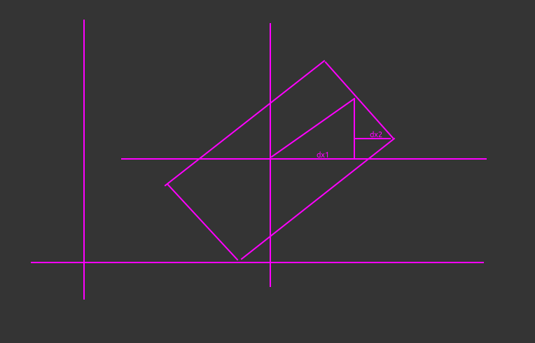

**. AABB包围盒**

在游戏中，为了简化物体之间的碰撞检测运算，通常会对物体创建一个规则的几何外形将其包围。

其中，AABB（[axis](https://so.csdn.net/so/search?q=axis&spm=1001.2101.3001.7020)-aligned bounding box）包围盒被称为轴对其包围盒。

 

二维场景中的AABB包围盒具备特点：（注：由于Cocos2d-x是基于[Opengl](https://so.csdn.net/so/search?q=Opengl&spm=1001.2101.3001.7020) ES的，所以下图中的所有坐标系均采用右手直角坐标系）

（1） 表现形式为四边形，即用四边形包围物体。

（2） 四边形的每一条边，都会与坐标系的轴垂直。

```C++
    计算一个顶点集合的AABB是非常简单的，先将最小值和最大值设为"正负无穷大"或任何比实际中用到的数都大或小得多的数。
    接着，遍历全部点，并扩展边界框直到它包含所有点为止。
    //--------------------------------------------------------------------------------------
    // Return one of the 8 corner points.   The points are numbered as follows:
    //
    //             6                                 7
	// 				  --------------------------------
    //               /								/|
    //              / |                            / |
    //             /  |                           /  |
    //            /   |                          /   |
    //           /    |                         /    |
    //          /     |                        /     |
    //         /      |                       /      |
    //        /       |                      /       |
    //       /        |                     /        |
    //      /         |                    /         |
    //   2 /          |                 3 /          |
    //    /------------------------------/           |
    //    |           |                  |           |
    //    |           |                  |           |       +Y
    //    |         4 |                  |           |
    //    |           |------------------|-----------|       |
    //    |          /                   |          /   5    |
    //    |         /                    |         /         |        +Z
    //    |        /                     |        /          |
    //    |       /                      |       /           |      /
    //    |      /                       |      /            |     /
    //    |     /                        |     /             |    /
    //    |    /                         |    /              |   /
    //    |   /                          |   /               | /
    //    | /                            | /                 |/
    //    |/                             |/                  ----------------- +X
    //    --------------------------------
    //   0                               1
    //
    // Bit 0 selects min.x vs. max.x
    // Bit 1 selects min.y vs. max.y
    // Bit 2 selects min.z vs. max.z
    //--------------------------------------------------------------------------------------
```

