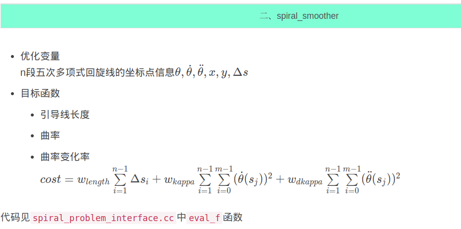
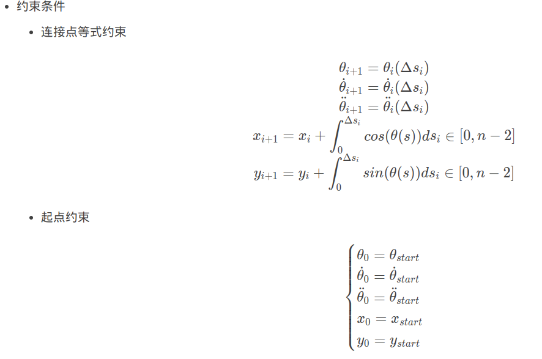
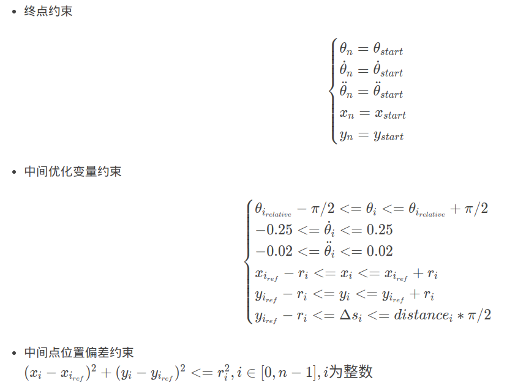

https://blog.csdn.net/xl_courage/article/details/121569105




```C++
bool SpiralProblemInterface::eval_f(int n, const double* x, bool new_x,
                                    double& obj_value) {
  CHECK_EQ(n, num_of_variables_);
  if (new_x) {
    update_piecewise_spiral_paths(x, n);
  }

  obj_value = 0.0;
  for (int i = 0; i + 1 < num_of_points_; ++i) {
    const auto& spiral_curve = piecewise_paths_[i];
    double delta_s = spiral_curve.ParamLength();

    obj_value += delta_s * weight_curve_length_;
    for (int j = 0; j < num_of_internal_points_; ++j) {
      double ratio =
          static_cast<double>(j) / static_cast<double>(num_of_internal_points_);
      double s = ratio * delta_s;

      double kappa = spiral_curve.Evaluate(1, s);
      obj_value += kappa * kappa * weight_kappa_;

      double dkappa = spiral_curve.Evaluate(2, s);
      obj_value += dkappa * dkappa * weight_dkappa_;
    }
  }
  return true;
}
```





约束条件代码见`spiral_problem_interface.cc`中`get_bounds_info`函数和`eval_g`函数

```C++
bool SpiralProblemInterface::get_bounds_info(int n, double* x_l, double* x_u,
                                             int m, double* g_l, double* g_u) {
  CHECK_EQ(n, num_of_variables_);
  CHECK_EQ(m, num_of_constraints_);

  // variables
  // a. for theta, kappa, dkappa, x, y
  for (int i = 0; i < num_of_points_; ++i) {
    int index = i * 5;

    double theta_lower = 0.0;
    double theta_upper = 0.0;
    double kappa_lower = 0.0;
    double kappa_upper = 0.0;
    double dkappa_lower = 0.0;
    double dkappa_upper = 0.0;
    double x_lower = 0.0;
    double x_upper = 0.0;
    double y_lower = 0.0;
    double y_upper = 0.0;
    if (i == 0 && has_fixed_start_point_) {
      theta_lower = start_theta_;
      theta_upper = start_theta_;
      kappa_lower = start_kappa_;
      kappa_upper = start_kappa_;
      dkappa_lower = start_dkappa_;
      dkappa_upper = start_dkappa_;
      x_lower = start_x_;
      x_upper = start_x_;
      y_lower = start_y_;
      y_upper = start_y_;

    } else if (i + 1 == num_of_points_ && has_fixed_end_point_) {
      theta_lower = end_theta_;
      theta_upper = end_theta_;
      kappa_lower = end_kappa_;
      kappa_upper = end_kappa_;
      dkappa_lower = end_dkappa_;
      dkappa_upper = end_dkappa_;
      x_lower = end_x_;
      x_upper = end_x_;
      y_lower = end_y_;
      y_upper = end_y_;
    } else if (i + 1 == num_of_points_ && has_fixed_end_point_position_) {
      theta_lower = relative_theta_[i] - M_PI * 0.2;
      theta_upper = relative_theta_[i] + M_PI * 0.2;
      kappa_lower = -0.25;
      kappa_upper = 0.25;
      dkappa_lower = -0.02;
      dkappa_upper = 0.02;
      x_lower = end_x_;
      x_upper = end_x_;
      y_lower = end_y_;
      y_upper = end_y_;
    } else {
      theta_lower = relative_theta_[i] - M_PI * 0.2;
      theta_upper = relative_theta_[i] + M_PI * 0.2;
      kappa_lower = -0.25;
      kappa_upper = 0.25;
      dkappa_lower = -0.02;
      dkappa_upper = 0.02;
      x_lower = init_points_[i].x() - default_max_point_deviation_;
      x_upper = init_points_[i].x() + default_max_point_deviation_;
      y_lower = init_points_[i].y() - default_max_point_deviation_;
      y_upper = init_points_[i].y() + default_max_point_deviation_;
    }

    // theta
    x_l[index] = theta_lower;
    x_u[index] = theta_upper;

    // kappa
    x_l[index + 1] = kappa_lower;
    x_u[index + 1] = kappa_upper;

    // dkappa
    x_l[index + 2] = dkappa_lower;
    x_u[index + 2] = dkappa_upper;

    // x
    x_l[index + 3] = x_lower;
    x_u[index + 3] = x_upper;

    // y
    x_l[index + 4] = y_lower;
    x_u[index + 4] = y_upper;
  }

  // b. for delta_s
  int variable_offset = num_of_points_ * 5;
  for (int i = 0; i + 1 < num_of_points_; ++i) {
    x_l[variable_offset + i] =
        point_distances_[i] - 2.0 * default_max_point_deviation_;
    x_u[variable_offset + i] = point_distances_[i] * M_PI * 0.5;
  }

  // constraints
  // a. positional equality constraints
  for (int i = 0; i + 1 < num_of_points_; ++i) {
    // for x
    g_l[i * 2] = 0.0;
    g_u[i * 2] = 0.0;

    // for y
    g_l[i * 2 + 1] = 0.0;
    g_u[i * 2 + 1] = 0.0;
  }
  // b. positional deviation constraints
  int constraint_offset = 2 * (num_of_points_ - 1);
  for (int i = 0; i < num_of_points_; ++i) {
    g_l[constraint_offset + i] = 0.0;
    g_u[constraint_offset + i] =
        default_max_point_deviation_ * default_max_point_deviation_;
  }
  return true;
}
```

```C++
bool SpiralProblemInterface::eval_g(int n, const double* x, bool new_x, int m,
                                    double* g) {
  CHECK_EQ(n, num_of_variables_);
  CHECK_EQ(m, num_of_constraints_);

  if (new_x) {
    update_piecewise_spiral_paths(x, n);
  }

  // first, fill in the positional equality constraints
  for (int i = 0; i + 1 < num_of_points_; ++i) {
    int index0 = i * 5;
    int index1 = (i + 1) * 5;

    const auto& spiral_curve = piecewise_paths_[i];
    double delta_s = spiral_curve.ParamLength();
    //x(i+1)和x(i) 等式约束
    double x_diff = x[index1 + 3] - x[index0 + 3] -
                    spiral_curve.ComputeCartesianDeviationX(delta_s);
    g[i * 2] = x_diff * x_diff;
    //y(i+1)和x(i) 等式约束
    double y_diff = x[index1 + 4] - x[index0 + 4] -
                    spiral_curve.ComputeCartesianDeviationY(delta_s);
    g[i * 2 + 1] = y_diff * y_diff;
  }

  // second, fill in the positional deviation constraints
  //位置平移 约束
  int constraint_offset = 2 * (num_of_points_ - 1);
  for (int i = 0; i < num_of_points_; ++i) {
    int variable_index = i * 5;
    double x_cor = x[variable_index + 3];
    double y_cor = x[variable_index + 4];

    double x_diff = x_cor - init_points_[i].x();
    double y_diff = y_cor - init_points_[i].y();

    g[constraint_offset + i] = x_diff * x_diff + y_diff * y_diff;
  }
  return true;
}
```

